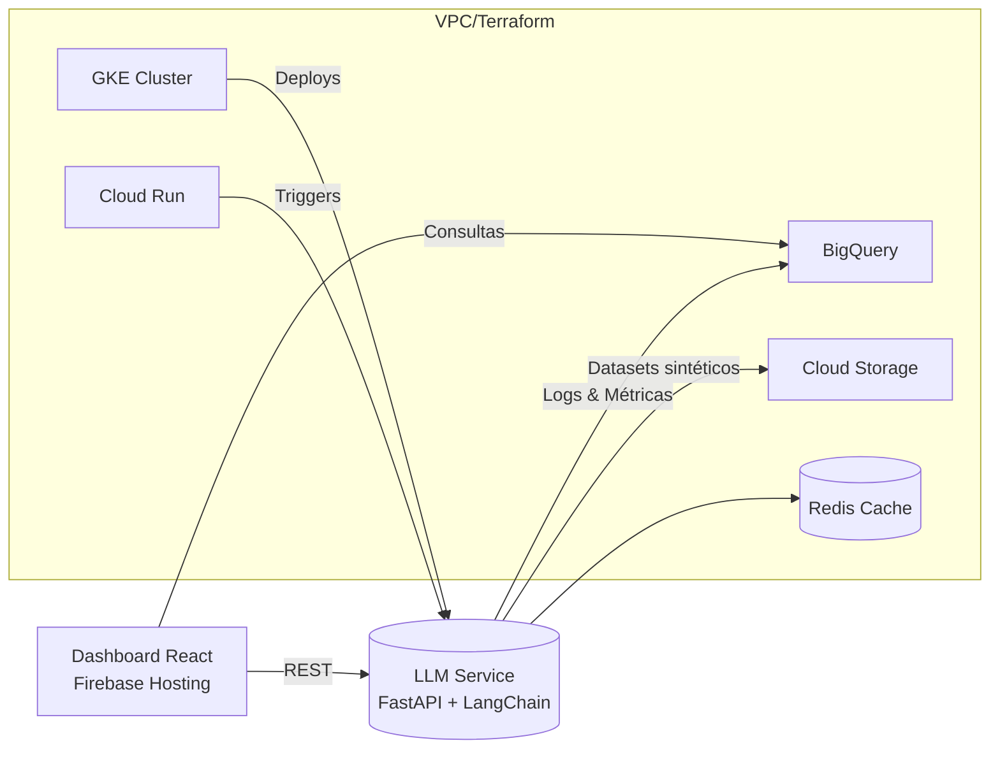

# Panel de Usuarios Sintéticos con LLMs 

**Primera iteración de**: Jorge Polanco Roque
**Fecha**: 220525

---

## 1. Objetivo 🎯  
Construir un **panel de usuarios sintéticos** (consumidores + tenderos) generado con modelos de lenguaje (LLMs) que permita:
* Simular comportamientos y conversaciones **sin exponer datos reales**.  
* Validar hipótesis de mercado, pricing y UX antes de salir a producción.  
* Entrenar modelos predictivos / de recomendación con datasets sintéticos.  
* Proveer KPIs accionables a equipos de Marketing, Producto y Ventas.

---

## 2. Antecedentes & Alcance 🗺️  
| Eje | Alcance propuesto |
|-----|------------------|
| **Datos base** | Encuestas de consumidores y tenderos (archivos provistos) + reglas de negocio del cliente. |
| **Salida clave** | Dashboard web + API REST |
| **Región Cloud** | Google Cloud Platform (GCP) |
| **Integraciones** | CRM (opcional), Lakehouse BigQuery, herramientas BI del cliente. |

---

## 3. Beneficios Clave 💡  
1. **Time-to-Insight < 4 semanas**: pruebas de mercado sin logística de reclutamiento.  
2. **Ahorro en costos** vs. paneles tradicionales y compras de muestras de datos.  
3. **Cumplimiento de privacidad** (no PII real) → facilita auditoría y GDPR/LFPPP.  
4. **Escalabilidad horizontal** con GKE / Cloud Run → picos de simulaciones bajo demanda.  

---

## 4. Arquitectura de Referencia 🏗️  

---

## 5. Componentes Tecnológicos 🔧  
| Capa | Stack | Servicios GCP |
|------|-------|---------------|
| **AI Service** | Python 3.11, FastAPI, LangChain, OpenAI SDK | Cloud Run / GKE |
| **Data** | Inputs del cliente | BigQuery, Cloud Storage
| **Frontend** | React 18, Recharts, Tailwind, NextAuth | Firebase Hosting |
| **DevOps / IaC** | Terraform, GitHub Actions, Cloud Build | Container Registry, VPC |

---

## 6. Seguridad & Gobierno de Datos 🔒  
* **Encriptación**: AES-256 at rest, TLS 1.3 in transit.  
* **Principio de Mínimo Acceso**: IAM roles por microservicio.  
* **Auditoría**: Cloud Audit Logs + alertas en Grafana / Cloud Monitoring.  
* **Cumplimiento**: GDPR, ISO 27001, SOC 2 (dependiendo de los servicios GCP).  

---

## 7. Recurso Humano 👩‍💻  
| Rol - dedicación | Habilidades críticas |
|------------------|----------------------|
| **Ingeniero(a) Full-Stack IA** (100 %) | LLMs & embeddings, Python / FastAPI, Docker, Cloud Run / GKE, LangChain. |
| **DevOps Cloud** (25 %) | Terraform, CI/CD, observabilidad, VPC design. |
| **Frontend** (25 %) | React / Next.js, d3/recharts, diseño UX Data-Viz e integración OAuth. |

---

## 8. Fases del Proyecto (ESTIMADO) 📅  

| Fase | Semanas | Entregables clave |
|------|---------|-------------------|
| **1. Kick-off & Refinamiento** | 1 | Roadmap, historias de usuario, OKRs. |
| **2. Prototipo AI Service** | 2 | Endpoint + pruebas unitarias, dataset sintético v0. |
| **3. MVP Dashboard & Bot** | 3 | UI interactiva. |
| **4. Beta Interna + Feedback** | 4 | Informe de insights, tuning de simulaciones, KPIs. |
| **5. Hardening & IaC** | 2 | Terraform (VPC + GKE), pipelines GitHub Actions. |
| **6. Piloto con Datos Reales** | 2 | Validación con stakeholders, plan de escalamiento. |

_Total proyecto: **14 semanas** (≈ 3,5 mes-persona)_  

---

## 9. Indicadores de Éxito 📊  
* ⌛ **Latencia** de consulta < 30 seg.  
* 🧩 **Cobertura** ≥ 90 % de escenarios de negocio definidos.  
* 🛡️ **Incidentes de seguridad** = 0 durante piloto.  
* 📈 **Adopción interna** ≥ 3 áreas en ≤ 3 meses posteriores al lanzamiento.

---

## 10. Riesgos & Mitigaciones ⚠️  

| Riesgo | Impacto | Mitigación |
|--------|---------|-----------|
| *Hallucination* LLM | Medio | Few-shot prompts, reglas post-proceso, QA manual inicial. |
| Complejidad IaC | Medio | Módulos Terraform reutilizables + revisiones PR obligatorias. |
| Dependencia de terceros (Twilio) | Bajo | Alternativas SMS / Email + abstracción de capa mensajería. |

---

## 11. Modelo de Costos 💰

| Concepto | Costo |
|----------|-------|
| OpenAI API (dev/prod) | **TBD** |
| Cloud Run / GKE | **TBD** |
| BigQuery (almacenamiento + consultas) | **TBD** |
| Cloud Storage backups | **TBD** |

_(CAPEX inicial = esfuerzo de desarrollo indicado en la Fase de Proyecto.)_  

---
