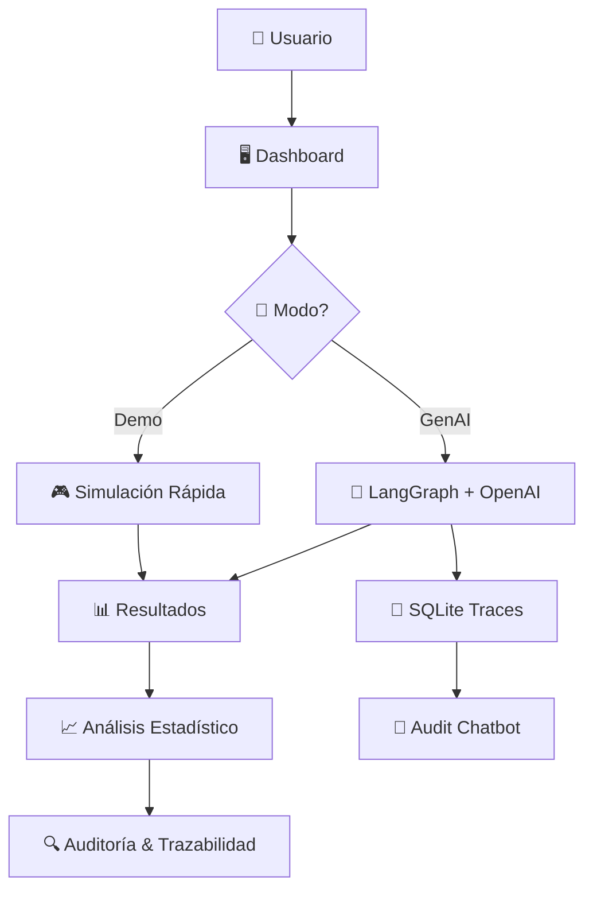

# 🗳️ Buyer Synthetic™ - AI-Powered Electoral Survey Platform


**Buyer Synthetic™** es una plataforma avanzada de encuestas electorales que utiliza inteligencia artificial para generar respuestas sintéticas realistas basadas en perfiles demográficos representativos de Perú 2024-2026.

## 🌟 **Características Principales**

### 🎯 **Dual Mode Operation**
- **Demo Mode**: Respuestas simuladas instantáneas (sin API)
- **GenAI Mode**: Respuestas generadas con IA usando LangGraph + OpenAI GPT-4

### 🔍 **Advanced Traceability System**
- Sistema completo de auditoría y trazabilidad
- Chatbot conversacional para consultar procesos (LangGraph)
- Base de datos SQLite organizada por fechas
- Exportación de resúmenes en JSON

### 📊 **Comprehensive Analytics**
- Análisis estadístico completo
- Visualizaciones interactivas con Plotly
- Distribuciones demográficas representativas
- Métricas de confianza y completitud

### 🏗️ **Modern Architecture**
- Next.js-inspired Python architecture
- Microservices con agentes especializados
- Containerización Docker completa
- Gestión de secretos con HashiCorp Vault

---

## 🚀 **Quick Start**

### **Opción 1: Ambiente Pre-configurado (Recomendado)**

```bash
# 1. Verificar funcionamiento
make test-integration

# 2. Ejecutar dashboard
make dev
```

### **Opción 2: Setup desde Cero**

```bash
# 1. Crear ambiente virtual
python3 -m venv .venv

# 2. Activar ambiente
source .venv/bin/activate  # macOS/Linux
# .venv\Scripts\activate   # Windows

# 3. Instalar dependencias
pip install -e .

# 4. Verificar instalación
make test-integration

# 5. Ejecutar proyecto
make dev
```

---

## 📋 **Requisitos del Sistema**

### **Software Requerido**
- **Python**: 3.11+ (recomendado 3.12)
- **Docker**: 20+ (opcional, para contenedores)
- **Git**: 2.30+ (para control de versiones)

### **Dependencias Python Principales**
```
streamlit>=1.28.0          # Dashboard web
langgraph>=0.2.0           # Orchestración de agentes IA
langchain-openai>=0.1.0    # Integración OpenAI
openai>=1.30.0             # API OpenAI
pandas>=2.1.0              # Manipulación de datos
plotly>=5.17.0             # Visualizaciones
pydantic>=2.5.0            # Validación de datos
scipy>=1.11.0              # Análisis estadístico
```

### **Dependencias Opcionales**
```
hvac>=1.2.0                # HashiCorp Vault (gestión de secretos)
docker>=6.1.0              # SDK Docker Python
pytest>=7.4.0             # Testing framework
ruff>=0.1.0                # Linter ultra-rápido
black>=23.0.0              # Formateador de código
mypy>=1.7.0                # Type checking
```


---

## ⚙️ **Configuración**

### **1. Variables de Entorno**

Crea un archivo `.env` en la raíz del proyecto:

```bash
# API Keys
OPENAI_API_KEY=sk-your-openai-api-key-here

# Model Configuration
DEFAULT_MODEL=gpt-4
TEMPERATURE=0.7
MAX_TOKENS=2000

# Survey Configuration
DEFAULT_SAMPLE_SIZE=300
LANGGRAPH_MAX_RETRIES=2
LANGGRAPH_VALIDATION_THRESHOLD=0.7

# Logging
LOG_LEVEL=INFO

# Vault Configuration (Opcional)
VAULT_ENABLED=false
VAULT_ADDR=http://localhost:8200
VAULT_TOKEN=your-vault-token
```

### **2. Configuración de API Key OpenAI**

#### **Opción A: Archivo .env (Recomendado para desarrollo)**
```bash
echo "OPENAI_API_KEY=sk-your-api-key-here" >> .env
```

#### **Opción B: Variable de entorno del sistema**
```bash
export OPENAI_API_KEY="sk-your-api-key-here"
```

#### **Opción C: HashiCorp Vault (Producción)**
```bash
# Habilitar Vault
echo "VAULT_ENABLED=true" >> .env
echo "VAULT_ADDR=http://localhost:8200" >> .env

# Configurar secreto en Vault
vault kv put secret/buyer-synthetic openai="sk-your-api-key-here"
```

---

## 🖥️ **Uso del Sistema**

### **Comandos Principales**

```bash
# 🚀 DESARROLLO
make dev                    # Dashboard principal (puerto 8505)
make dev-simple            # Dashboard básico
make audit-dashboard       # Dashboard de auditoría (puerto 8506)
make audit-chat            # Chatbot CLI de auditoría

# 🧪 TESTING
make test-integration      # Tests de integración completos
make test                  # Tests unitarios
make test-cov             # Tests con cobertura

# 🔧 CALIDAD DE CÓDIGO
make lint                 # Linters (ruff, black, isort)
make format              # Formatear código
make type-check          # Verificación de tipos
make security-check      # Análisis de seguridad

# 🐳 DOCKER
make docker-build        # Construir imagen
make docker-run          # Ejecutar contenedor
make docker-compose-up   # Servicios completos

# 🗄️ VAULT
make setup-vault         # Configurar Vault
make vault-status        # Estado de Vault

```

### **Flujo de Trabajo**

1. **🔧 Configurar**: `make dev`
2. **🎯 Seleccionar Modo**: Demo (instantáneo) o GenAI (IA)
3. **👥 Crear Muestra**: Perfiles demográficos representativos
4. **📝 Ejecutar Encuesta**: 10 preguntas electorales especializadas
5. **📊 Analizar Resultados**: Visualizaciones y estadísticas
6. **🔍 Auditar**: Consultar trazabilidad con chatbot IA

---

## 🌐 **Acceso a Servicios**

| Servicio | URL | Descripción |
|----------|-----|-------------|
| **Dashboard Principal** | http://localhost:8505 | Interfaz completa para encuestas |
| **Dashboard de Auditoría** | http://localhost:8506 | Sistema de trazabilidad |
| **Health Check** | http://localhost:8505/_stcore/health | Estado del servicio |

---

## 🐳 **Docker y Contenedores**

### **Docker Standalone**

```bash
# Construir imagen
docker build -t buyer-synthetic:latest .

# Ejecutar contenedor
docker run -p 8505:8505 --env-file .env buyer-synthetic:latest

# Con variables de entorno inline
docker run -p 8505:8505 \
  -e OPENAI_API_KEY="sk-your-key" \
  -e DEFAULT_SAMPLE_SIZE=300 \
  buyer-synthetic:latest
```

### **Docker Compose**

```bash
# Servicios básicos
docker-compose up -d

# Con Vault incluido
docker-compose --profile vault up -d

# Ver logs
docker-compose logs -f buyer-synthetic

# Parar servicios
docker-compose down
```

### **Configuración Docker Compose**

```yaml
# docker-compose.yml
version: '3.8'

services:
  buyer-synthetic:
    build: .
    ports:
      - "8505:8505"
    environment:
      - OPENAI_API_KEY=${OPENAI_API_KEY}
      - DEFAULT_SAMPLE_SIZE=300
    volumes:
      - ./data:/app/data
    restart: unless-stopped

  vault:
    image: vault:1.15
    profiles: ["vault"]
    ports:
      - "8200:8200"
    environment:
      - VAULT_DEV_ROOT_TOKEN_ID=dev-token
      - VAULT_DEV_LISTEN_ADDRESS=0.0.0.0:8200
    cap_add:
      - IPC_LOCK
```

---

## 🔐 **Gestión de Secretos**

### **HashiCorp Vault (Recomendado para Producción)**

#### **Setup Inicial**
```bash
# Instalar Vault
brew install vault  # macOS
# apt-get install vault  # Ubuntu

# Inicializar y configurar
make setup-vault

# Verificar estado
make vault-status
```

#### **Configurar Secretos**
```bash
# Autenticar
vault auth -method=userpass username=admin

# Guardar API key
vault kv put secret/buyer-synthetic \
  openai="sk-your-openai-api-key" \
  model="gpt-4" \
  temperature="0.7"

# Leer secreto
vault kv get secret/buyer-synthetic
```

#### **Integración en la Aplicación**
```python
# La aplicación automáticamente lee de Vault si está habilitado
VAULT_ENABLED=true
VAULT_ADDR=http://localhost:8200
VAULT_TOKEN=your-vault-token
```

### **Alternativas de Gestión de Secretos**

#### **1. Variables de Entorno**
```bash
# En .bashrc/.zshrc
export OPENAI_API_KEY="sk-your-key"
export BUYER_SYNTHETIC_ENV="production"
```

#### **2. Archivos de Configuración**
```bash
# config/production.env
OPENAI_API_KEY=sk-your-key
DEFAULT_MODEL=gpt-4
TEMPERATURE=0.7
```

#### **3. Servicios en la Nube**
- **AWS Secrets Manager**
- **Azure Key Vault** 
- **Google Secret Manager**

---

## 🏗️ **Arquitectura del Sistema**

### **Estructura del Proyecto**

```
buyer-synthetic/
├── 📁 src/buyer_synthetic/          # 🐍 Código fuente principal
│   ├── 🤖 agents/                   # Agentes de IA especializados
│   │   ├── survey_creator.py        # Creador de muestras demográficas
│   │   ├── survey_executor.py       # Executor básico de encuestas
│   │   ├── survey_executor_langgraph.py  # Executor con LangGraph
│   │   ├── results_visualizer.py    # Visualizador de resultados
│   │   └── audit_chatbot.py         # Chatbot de auditoría
│   ├── ⚙️ config/                   # Configuraciones del sistema
│   │   ├── settings.py              # Settings centralizados
│   │   └── vault_client.py          # Cliente HashiCorp Vault
│   ├── 🔧 core/                     # Componentes centrales
│   │   ├── tracer.py                # Sistema de trazabilidad
│   │   └── models.py                # Modelos de datos Pydantic
│   ├── 🖥️ ui/                       # Interfaces de usuario
│   │   ├── dashboard.py             # Dashboard principal
│   │   ├── dashboard_simple.py      # Dashboard básico
│   │   └── audit_dashboard.py       # Dashboard de auditoría
│   ├── 🛠️ utils/                    # Utilidades compartidas
│   │   ├── logger.py                # Sistema de logging
│   │   └── validators.py            # Validadores de datos
│   └── 📊 analysis/                 # Análisis estadístico
│       └── statistical_analyzer.py  # Analizador estadístico
├── 🧪 tests/                        # Suite de pruebas
│   ├── test_langgraph_integration.py # Tests de integración
│   ├── test_agents.py               # Tests de agentes
│   └── test_utils.py                # Tests de utilidades
├── 📁 data/                         # Datos y resultados
│   ├── input/                       # Datos de entrada
│   ├── output/                      # Resultados generados
│   ├── audit_traces/                # Trazas de auditoría (por fecha)
│   └── temp/                        # Archivos temporales
├── 🐳 docker/                       # Configuraciones Docker
├── 📜 scripts/                      # Scripts de utilidad
├── 📋 requirements/                 # Dependencias por ambiente
├── 🔧 Makefile                      # Comandos de desarrollo
├── 🐳 docker-compose.yml           # Orquestación de servicios
├── 📦 pyproject.toml               # Configuración Poetry
└── 📖 README.md                    # Esta documentación
```

### **Agentes Especializados**

```python
# 🏗️ SurveyCreatorAgent
- Genera muestras demográficas representativas
- Distribución basada en datos reales de Perú 2024
- Perfiles con NSE, región, edad, género, ocupación

# 🤖 SurveyExecutorLangGraph  
- Execución de encuestas con IA (GenAI Mode)
- Workflow de LangGraph con validación
- Integración OpenAI GPT-4 con contexto peruano

# 📊 ResultsVisualizerAgent
- Análisis estadístico avanzado
- Visualizaciones interactivas con Plotly
- Insights automáticos y recomendaciones

# 🔍 AuditChatbot
- Chatbot conversacional para auditoría
- Consultas en lenguaje natural sobre procesos
- Análisis de trazabilidad y métricas
```

### **Flujo de Datos**



---

## 🧪 **Testing y Calidad**

### **Ejecutar Tests**

```bash
# Tests completos de integración
make test-integration

# Tests unitarios
make test

# Tests con cobertura
make test-cov

# Tests específicos
pytest tests/test_agents.py -v
pytest tests/test_langgraph_integration.py::test_genai_mode -v
```

### **Linting y Formateo**

```bash
# Linters completos
make lint

# Formatear código
make format

# Type checking
make type-check

# Análisis de seguridad
make security-check

# Todo junto
make check-all
```

### **Estructura de Tests**

```python
# tests/test_langgraph_integration.py
def test_demo_mode():
    """Test completo del Demo Mode"""
    # Crear muestra, ejecutar encuesta, verificar resultados

def test_genai_mode():
    """Test del GenAI Mode con LangGraph"""
    # Verificar API key, ejecutar con IA, validar respuestas

def test_dashboard_integration():
    """Test de integración con dashboard"""
    # Importar dashboard, verificar configuración
```

---

## 📊 **Monitoreo y Logging**

### **Sistema de Logs**

```python
# Configuración en settings.py
LOG_LEVEL = "INFO"  # DEBUG, INFO, WARNING, ERROR
LOG_FORMAT = "%(asctime)s - %(name)s - %(levelname)s - %(message)s"

# Usar logger en código
from buyer_synthetic.utils.logger import get_logger
logger = get_logger(__name__)

logger.info("Iniciando proceso de encuesta")
logger.error("Error en validación", extra={"trace_id": trace_id})
```

### **Trazabilidad Avanzada**

```python
# Sistema de trazas SQLite
from buyer_synthetic.core.tracer import get_tracer

tracer = get_tracer()

# Iniciar trace
trace_id = tracer.start_trace(
    agent_name="SurveyExecutor",
    operation="generate_responses",
    inputs={"sample_size": 100}
)

# Log de eventos
tracer.log_llm_call(trace_id, "gpt-4", prompt, response, tokens=150)
tracer.log_validation(trace_id, passed=True, score=0.85)

# Finalizar trace
tracer.end_trace(trace_id, outputs={"responses": 100})
```

### **Métricas y Estadísticas**

```python
# Obtener estadísticas de trazas
stats = tracer.get_trace_statistics()
print(f"Total events: {stats['total_events']}")
print(f"Success rate: {(stats['total_traces'] - stats['total_errors']) / stats['total_traces']:.2%}")

# Exportar resumen de sesión
summary_path = tracer.export_session_summary(session_id)
```

---

## 🔧 **Troubleshooting**

### **Errores Comunes**

#### **❌ ModuleNotFoundError**
```bash
# Verificar ambiente virtual
which python
pip list | grep streamlit

# Reinstalar dependencias
pip install -e . --force-reinstall
```

#### **❌ OPENAI_API_KEY no configurada**
```bash
# Verificar variable
echo $OPENAI_API_KEY

# Configurar temporalmente
export OPENAI_API_KEY="sk-your-key"

# Verificar en .env
cat .env | grep OPENAI
```

#### **❌ Puerto 8505 ocupado**
```bash
# Ver qué proceso usa el puerto
lsof -i :8505

# Usar puerto alternativo
.venv/bin/streamlit run src/buyer_synthetic/ui/dashboard.py --server.port 8506
```

#### **❌ Error de permisos Docker**
```bash
# Agregar usuario al grupo docker
sudo usermod -aG docker $USER

# Reiniciar sesión
logout
```

#### **❌ Error en "Crear Encuesta": AgentTracer.start_trace() got an unexpected keyword argument 'parent_trace_id'**
```bash
# Este error ya está corregido en la versión actual
# Si persiste, verificar que tienes la versión más reciente:
git pull origin main
make test-integration
```

#### **❌ Error en "Auditoría de Procesos": KeyError: 'survey_mode'**
```bash
# Este error ya está corregido en la versión actual
# Ocurría cuando Demo Mode no incluía la columna 'survey_mode'
# Si persiste, verificar que tienes la versión más reciente:
git pull origin main
make test-integration
```

### **Debugging**

#### **Modo Debug**
```bash
# Habilitar logs detallados
export LOG_LEVEL=DEBUG

# Ejecutar con debugging
python -m pdb src/buyer_synthetic/ui/dashboard.py
```

#### **Inspeccionar Traces**
```bash
# Chatbot de auditoría CLI
make audit-chat

# Dashboard de auditoría
make audit-dashboard

# Explorar base de datos
sqlite3 data/audit_traces/2025-07-10/traces_*.db
.tables
SELECT * FROM traces LIMIT 5;
```

### **Performance**

#### **Optimización de Memoria**
```python
# Configurar batch size según memoria disponible
# GenAI Mode: 1-5 perfiles por lote
# Demo Mode: 10-50 perfiles por lote

# Monitorear uso de memoria
import psutil
memory_percent = psutil.virtual_memory().percent
```

#### **Optimización de API Calls**
```bash
# Usar modelos más rápidos para desarrollo
DEFAULT_MODEL=gpt-3.5-turbo  # Más rápido
# DEFAULT_MODEL=gpt-4        # Más preciso

# Reducir temperatura para respuestas más consistentes
TEMPERATURE=0.3
```

---

## 🚀 **Deployment**

### **Desarrollo Local**
```bash
# Setup completo
make setup

# Desarrollo con auto-reload
make dev-watch
```

### **Staging**
```bash
# Build y test
make ci-local

# Deploy con Docker
docker-compose -f docker-compose.staging.yml up -d
```

### **Producción**
```bash
# Con Vault y monitoring
docker-compose --profile production up -d

# Health check
curl -f http://localhost:8505/_stcore/health
```

### **Configuración de Nginx (Opcional)**
```nginx
# /etc/nginx/sites-available/buyer-synthetic
server {
    listen 80;
    server_name your-domain.com;
    
    location / {
        proxy_pass http://localhost:8505;
        proxy_set_header Host $host;
        proxy_set_header X-Real-IP $remote_addr;
        proxy_set_header X-Forwarded-For $proxy_add_x_forwarded_for;
        proxy_set_header X-Forwarded-Proto $scheme;
    }
}
```

---

## 📊 **Datos Demográficos Perú 2024**

### **Distribución por NSE**
- **NSE A**: 5% - Alta capacidad adquisitiva
- **NSE B**: 15% - Clase media-alta profesional
- **NSE C**: 35% - Clase media emergente
- **NSE D**: 25% - Clase trabajadora
- **NSE E**: 20% - Sectores populares

### **Distribución Regional**
- **Lima**: 33% - Área metropolitana
- **Costa**: 11% - Ciudades costeras
- **Sierra**: 30% - Región andina
- **Selva**: 26% - Región amazónica

### **Preguntas Electorales Pre-configuradas**
1. **Intención de Voto**: Candidatos presidenciales 2026
2. **Aprobación Gubernamental**: Escala 1-10
3. **Principal Problema**: Corrupción, economía, seguridad, etc.
4. **Confianza Institucional**: Democracia y estado de derecho
5. **Expectativa Económica**: Perspectivas a 6 meses
6. **Prioridad Gubernamental**: Agenda del próximo gobierno
7. **Reforma Constitucional**: Posición frente a cambios
8. **Descentralización**: Lima vs. regiones
9. **Medios de Información**: Fuentes de noticias políticas
10. **Participación Electoral**: Probabilidad de votar

---

## 🔍 **Sistema de Auditoría Completo**

### **Dashboard de Auditoría (Paso 4)**

#### **📊 Tab: Datos de Encuesta**
- **Métricas Generales**: Total respuestas, completitud, confianza promedio
- **Distribución por Modo**: Demo vs GenAI con gráficos interactivos
- **Detección de Errores**: Análisis automático de problemas
- **Exportación**: Descarga de resultados en CSV

#### **🔍 Tab: Trazabilidad**
- **Filtros Avanzados**: Por agente, operación, nivel, fecha
- **Estadísticas**: Trazas exitosas, errores, duración promedio
- **Timeline Interactivo**: Visualización temporal de ejecución
- **Métricas de Performance**: Análisis de rendimiento

#### **🤖 Tab: Chatbot de Auditoría**
- **Chat Conversacional**: Preguntas en lenguaje natural
- **Preguntas Sugeridas**: Consultas comunes pre-definidas
- **Análisis Inteligente**: Respuestas contextualizadas con LangGraph
- **Historial**: Conservación de conversaciones

#### **📁 Tab: Archivos de Trace**
- **Explorador de Archivos**: Navegación por fecha y tipo
- **Información Detallada**: Tamaño, fecha modificación, registros
- **Descarga**: Export de bases de datos SQLite
- **Vista Previa**: Contenido de tablas y estadísticas

### **Ejemplos de Consultas al Chatbot**

```bash
# Consultas de proceso
"¿Qué agentes se ejecutaron hoy?"
"¿Cuántas trazas se generaron en la última sesión?"
"Muéstrame los detalles del trace abc-123"

# Consultas de rendimiento  
"¿Cuál fue el tiempo promedio de ejecución?"
"¿Qué operación consumió más tokens?"
"¿Hubo errores en el procesamiento?"

# Consultas de validación
"¿Pasaron todas las validaciones?"
"¿Qué score de confianza tuvieron las respuestas?"
"¿Cómo se distribuyeron las respuestas por NSE?"
```

---

## 🤝 **Contribuir**

### **Setup de Desarrollo**
```bash
# Fork y clone
git clone https://github.com/tu-usuario/buyer-synthetic.git
cd buyer-synthetic

# Setup ambiente
make setup

# Instalar pre-commit hooks
make pre-commit-install

# Verificar setup
make check-all
```

### **Workflow de Desarrollo**
```bash
# 1. Crear feature branch
git checkout -b feature/nueva-funcionalidad

# 2. Desarrollar
# ... hacer cambios ...

# 3. Tests y calidad
make check-all

# 4. Commit
git add .
git commit -m "feat: nueva funcionalidad"

# 5. Push y PR
git push origin feature/nueva-funcionalidad
```

### **Estándares de Código**
- **Python**: PEP 8 con Black formatting
- **Type Hints**: Obligatorios para funciones públicas
- **Docstrings**: Google style para clases y métodos
- **Tests**: Cobertura mínima 80%
- **Commits**: Conventional Commits format

---

## 📄 **Licencia**

Este proyecto está licenciado bajo la MIT License. Ver [LICENSE](LICENSE) para más detalles.

---

## 👥 **Soporte y Comunidad**

### **Documentación**
- **API Reference**: [docs/api/](docs/api/)
- **Architecture Guide**: [docs/architecture.md](docs/architecture.md)
- **Deployment Guide**: [docs/deployment.md](docs/deployment.md)

### **Soporte**
- **Issues**: [GitHub Issues](https://github.com/buyer-synthetic/issues)
- **Discussions**: [GitHub Discussions](https://github.com/buyer-synthetic/discussions)
- **Email**: support@buyer-synthetic.com

### **Roadmap**
- **Q4 2024**: Integración con más proveedores de IA
- **Q1 2025**: Dashboard móvil
- **Q2 2025**: API REST completa
- **Q3 2025**: Machine Learning avanzado

---

## 🙏 **Agradecimientos**

- **LangChain & LangGraph** por la orchestración de agentes
- **OpenAI** por los modelos GPT-4
- **Streamlit** por la interfaz web
- **INEI Perú** por los datos demográficos

---

**🗳️ Buyer Synthetic™** - Investigación sin campo, con IA • Peru 2024-2026

*Construido con ❤️ usando LangGraph, OpenAI GPT-4, y Streamlit*